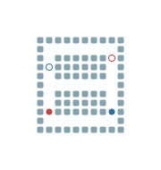

## MAPF-CBS

A basic implementation of the Conflict-Based Search (CBS) for the Multi-Agent
Path Finding (MAPF) Problem. The problem is to find a path for multiple
robots such that they could go through the shared pathways without having
a conflict with each other.
This implementation is inspired by multiple repos, as follows:
- https://github.com/gloriyo/MAPF-ICBS
- https://github.com/nicofretti/MAPF
The code in this implementation is heavily influenced by the following work:
- https://github.com/jainaviral898/mapp-cbs-aifa

## How to run
Run the file main.py

We can define a grid of our choosing for the variable named `grid`.
Larger grids seem to me taking much longer right now... need to 
look more into it.

## Visualization

## Couple of notes/observations
- This is a basic implementation of CBS. Multiple improvement approaches
exist for CBS, which I further plan to explore. These include
CBS + Disjoint Splitting
CBS + High Level Heuristics
CBS + Prioritising Conflicts
The last one is what I do plan to explore a bit next, since it seems to have
better performance, based on a graph in a report here:
https://github.com/polinko13/CBS/blob/main/cbs_report.pdf
However, Other implementations also exist and the newer variants are worth
looking into.
- It appears a C++ implementation may result in a speedup. I also plan to
explore that avenue
- CBS based approaches are one way to solve the problem. Other approaches
include Priority based planning as well as Constraint programming or
Mixed-Integer programming (MIP) based approaches. Some are more focussed on
path optimality, such as MIPs, and some on speed, such as priority-based
approaches.

Author - Arsalan Akhter